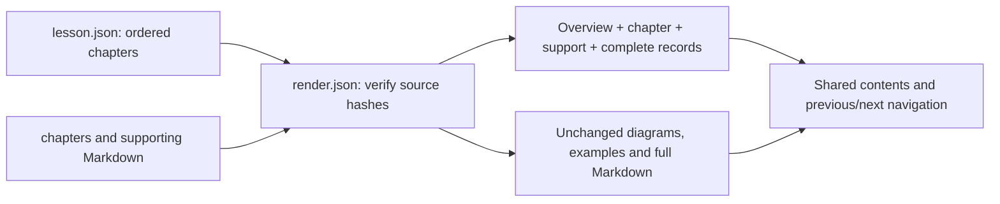

# Reader flow

```mermaid
flowchart LR
  Manifest[lesson.json: ordered chapters] --> Verify[render.json: verify source hashes]
  Markdown[chapters and supporting Markdown] --> Verify
  Verify --> Pages[Overview + chapter + support + complete records]
  Pages --> Reader[Shared contents and previous/next navigation]
  Verify --> Assets[Unchanged diagrams, examples and full Markdown]
  Assets --> Reader
```
